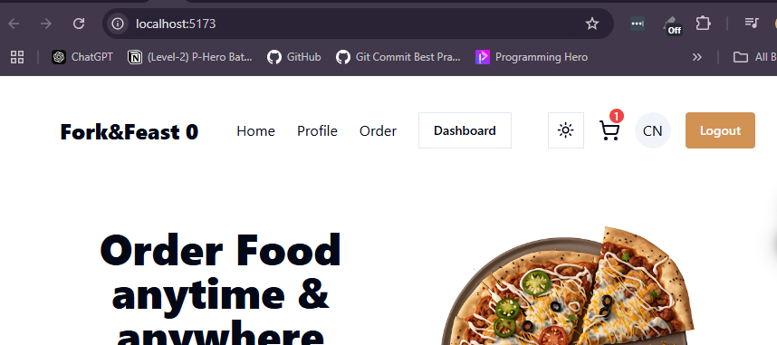

# Issue-1 : Zustand persist is not working while i'm trying to reloading my UI
##  Code 
```
import { create } from "zustand";
import { createJSONStorage, persist } from "zustand/middleware";


export const useCartStore = create(
    persist(
      (set) => ({
        count: 0,
        increment: () => set((state:any) => ({ count: state.count + 1 })),
      }),
      {
        name: "cart-name",
        storage: createJSONStorage(() => localStorage),
        onRehydrateStorage: () => (state) => {
          console.log("Rehydrated state:", state); // Debugging hydration
        },
      }
    )
  );
```


## Solved
    -> Solution
    -> i did not add it that's why we are facing some error
        ```
        <Button onClick={increment} className="bg-orange hover:bg-hoverOrangerounded">Logout</Button>
        ```